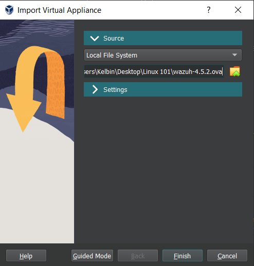

# Installing and Configuring SIEM

To install Wazuh via virtual box it is recommended that you use the pre-built virtual machine. This Open Virtual Applicance (OVA) can be imported to any OV compatible virtualization software like virtual box.&#x20;

Use the following link to download the Wazuh OVA: [https://documentation.wazuh.com/current/deployment-options/virtual-machine/virtual-machine.html](https://documentation.wazuh.com/current/deployment-options/virtual-machine/virtual-machine.html)

Importing the wazuh virtual appliance:



Verify resource settings - Follow the suggested hardware requirements listed in the Wazuh Documentation&#x20;

.png>)

Click finish and adjust network settings once the VM has been configured.&#x20;

Run the Virtual machine and login in using the default credentials. Make sure that the default username and password are changed afterwards.

.png>)

To access the wazuh dashboard use the following command:&#x20;

> ```
> ip a
> ```

Grab the Wazuh Server IP and access the web interface using the following credentials. \


```
URL: https://<wazuh_server_ip>
user: admin
password: admin
```

.png>)

Using this virtual applicance all components are configured to work out of the box however the following locations are where configurations can be found for customizability.&#x20;

* Wazuh manager: `/var/ossec/etc/ossec.conf`
* Wazuh indexer: `/etc/wazuh-indexer/opensearch.yml`
* Filebeat-OSS: `/etc/filebeat/filebeat.yml`
* Wazuh dashboard:
  * `/etc/wazuh-dashboard/opensearch_dashboards.yml`
  * `/usr/share/wazuh-dashboard/data/wazuh/config/wazuh.yml`

.png>)

.png>)
